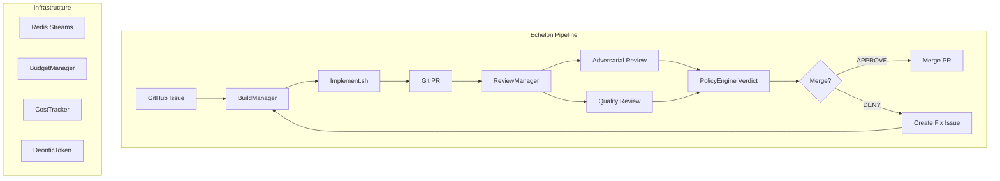

[](https://github.com/thepragmatik/echelon/actions/workflows/ci.yml)
[](https://thepragmatik.github.io/echelon/)
[](https://github.com/thepragmatik/echelon/releases)
[](https://adoptium.net/)
[](LICENSE)
[](https://github.com/thepragmatik/echelon/actions/workflows/codeql.yml)
[](https://github.com/thepragmatik/echelon)

> **"This project was written by AI agents. If that gives you pause, consider: your coffee was roasted by a machine, your car was assembled by robots, and this README was probably scanned by another AI before you read it. The code compiles, the tests pass, and the CI is green. Judge us by our output, not our origin."**

# Echelon

**Hierarchical Docker-based zero-trust agent swarm orchestration platform.**

Echelon orchestrates multi-agent AI swarms with deontic token governance, Redis-backed budget enforcement, and defense-in-depth container security — all running on commodity Docker infrastructure.

Built with Java 21+, Spring Boot 3.4+, Maven, Docker, and Redis.



---

## Quick Start

```bash
# Clone and start
git clone https://github.com/thepragmatik/echelon.git
cd echelon
docker compose -f echelon-docker/docker-compose.yml up -d

# Build and test
mvn clean compile
mvn test
```

---

## Architecture

Echelon implements a **deontic governance model** for agent swarms, inspired by ODP-EL compliance patterns from Milosevic & Rabhi (arXiv:2601.03624). The `DeonticToken` sealed interface — a Java 21 sealed type — defines three token variants: `Permit` (what each role may do), `Embargo` (what no role may do), and `Burden` (what each role must do). The `PolicyEngine` evaluates every action dispatch against the loaded tokens with **embargo-first, default-deny** semantics, ensuring compile-time exhaustiveness and runtime safety.

**Budget and cost tracking** is backed by Redis Streams for durability and scalability. `BudgetManager` enforces per-task (50k token) and per-agent-monthly (500k token) caps with configurable TTL, while `CostTracker` persists cost attribution entries in durable Redis streams — no more in-memory state lost on JVM restart. Both services are wired into the `BuildManager` orchestrator, which calls `PolicyEngine.evaluate()` before dispatching any task.

On the **security** front, Echelon applies defense-in-depth at every layer: seccomp profiles audited per container role (default for builders, strict for reviewers), filesystem allowlisting with per-container read/write/block policies, network default-deny with the Privacy Router as the sole egress point, and credential isolation scoped per container type. The **agent pipeline** follows a deterministic workflow: `BuildManager` → `implement.sh` (Pi-agent driven) → adversarial review → quality review, with checkpoint commits at every stage for crash resilience.

---

## Documentation

- 📖 **[Full Documentation](https://thepragmatik.github.io/echelon/)** — hosted on GitHub Pages (MkDocs Material theme)
- 🧾 **[Deontic Token Governance (ADR-001)](docs/architecture/adr-001-deontic-tokens.md)** — sealed interface design, PolicyEngine, priority chain
- 💰 **[Redis Budget/Cost Tracking (ADR-002)](docs/architecture/adr-002-redis-budget-streams.md)** — persistent budget enforcement and cost streams
- 🏛️ **[Governance Class Diagram](docs/architecture/governance-class-diagram.md)** — full class hierarchy with current vs. target phases
- 👩‍💻 **[Developer Guide](docs/developer-guide.md)** — setup, workflow, branching strategy, PR guidelines
- 🛠️ **[Runbook](docs/runbook.md)** — monitoring, troubleshooting, recovery procedures

---

## Project Status

| Phase | Description | Status |
|-------|-------------|--------|
| Phase 0 | Foundation (sealed interfaces, policy loading, test harness) | ✅ Complete |
| Phase 1 | Backbone (Redis streams, BuildManager wiring, CI) | ✅ Complete |
| Phase 2 | Governance (deontic engine, cost tracking, ADRs) | ✅ Complete |
| Phase 3 | Security (seccomp, fs allowlisting, network deny, credential isolation) | ✅ Complete |
| Phase 4 | L7 Policies + Skills (agent skills, L7 enforcement, RedisPolicyStore) | ✅ Complete |
| Phase 5 | Agent Pipeline (implement.sh, review pipeline, common.sh) | ✅ Complete |
| Phase 6 | Observability (Prometheus, backup/DR, health checks) | ✅ Complete |

---

## Quick Links

- 📖 **[Docs Site](https://thepragmatik.github.io/echelon/)**
- 🐛 **[Issues](https://github.com/thepragmatik/echelon/issues)**
- 🏷️ **[v0.3.1 Release](https://github.com/thepragmatik/echelon/releases/tag/v0.3.1)**
