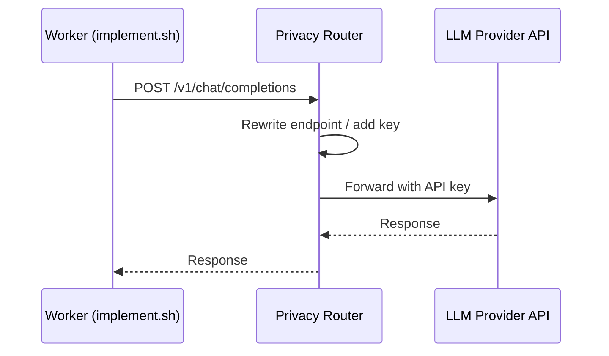

# Configuration Guide

This reference covers every configuration surface in Echelon — environment variables, Docker Compose customization, GitHub integration, LLM provider setup, submitting your first task, and troubleshooting common issues.

---

## 1. Environment Variables

Echelon reads configuration from a `.env` file at the project root. Copy the example file and edit it:

```bash
cp .env.example .env
```

### Core Variables

| Variable | Required | Description | Default |
|----------|----------|-------------|---------|
| `GH_TOKEN` | **Yes** | GitHub Personal Access Token for cloning repos, creating issues, and opening PRs. Scopes: `repo`, `issues`, `pull_requests`. | — |
| `REDIS_HOST` | No | Redis server hostname (used by manager services connecting externally) | `localhost` |
| `REDIS_PORT` | No | Redis server port | `6379` |
| `LOG_LEVEL` | No | Logging verbosity | `INFO` |

### LLM Provider API Keys

At least one LLM provider key is required for code generation. Echelon supports the following providers:

| Variable | Required | Description |
|----------|----------|-------------|
| `OPENAI_API_KEY` | No | OpenAI API key (`sk-...`) — for GPT-4o, o1, o3, etc. |
| `ANTHROPIC_API_KEY` | No | Anthropic API key (`sk-ant-...`) — for Claude Opus, Sonnet, Haiku |
| `WAFER_API_KEY` | No | Wafer API key — the default provider if no other key is set |

!!! tip "Provider Fallback"
    If no API keys are set, Echelon defaults to Wafer. Set at least one key before submitting tasks that require code generation.

### Proxy / Privacy Router Variables

When running in Docker Compose, the Privacy Router service handles LLM calls on behalf of workers. The router reads provider keys from its own environment (set in `docker-compose.yml`):

| Variable (docker-compose) | Description |
|---------------------------|-------------|
| `DEEPSEEK_API_KEY` | DeepSeek API key for the Privacy Router |
| `WAFER_API_KEY` | Wafer API key for the Privacy Router |
| `LLM_PROXY_URL` | Internal URL workers use to reach the Privacy Router (`http://privacy-router:8080`) |

---

## 2. Docker Configuration

Echelon uses Docker Compose located at `echelon-docker/docker-compose.yml`. The stack is organized into **four services** and **one optional profile**.

### Service Overview

| Service | Dockerfile | Role | Profile |
|---------|-----------|------|---------|
| `redis-primary` | `redis:7-alpine` | Primary Redis node — task queues, budget state, policy store | Always on |
| `redis-replica` | `redis:7-alpine` | Read replica for Redis (high availability) | Always on |
| `redis-sentinel` | `Dockerfile.sentinel` | Sentinel for automatic Redis failover | Always on |
| `privacy-router` | `Dockerfile.privacy-router` | LLM proxy — workers call this instead of APIs directly | Always on |
| `builder` | `Dockerfile.builder` | BuildManager — polls `tasks:build`, spawns implementers | `managers` |
| `reviewer` | `Dockerfile.reviewer` | ReviewManager — polls `tasks:review`, spawns reviewers | `managers` |

### Starting the Stack

```bash
# Start infrastructure (Redis, privacy router)
docker compose -f echelon-docker/docker-compose.yml up -d

# Start managers too (builder + reviewer)
docker compose -f echelon-docker/docker-compose.yml --profile managers up -d
```

### Customization Points

#### Redis Persistence

The compose file enables AOF (Append-Only File) persistence with three save strategies:

```yaml
command:
  - "redis-server"
  - "--appendonly"
  - "yes"
  - "--save"
  - "900 1"      # Save every 900s if ≥1 key changed
  - "--save"
  - "300 10"     # Save every 300s if ≥10 keys changed
  - "--save"
  - "60 10000"   # Save every 60s if ≥10,000 keys changed
```

Adjust save intervals or switch to RDB-only by modifying the `command` array.

#### Resource Limits

Add resource constraints to prevent a single service from starving others:

```yaml
services:
  builder:
    deploy:
      resources:
        limits:
          cpus: "2"
          memory: "4G"
  reviewer:
    deploy:
      resources:
        limits:
          cpus: "2"
          memory: "4G"
```

#### Network Isolation

The compose file uses a single `echelon-internal` bridge network. For production, consider:

- Adding a reverse proxy (e.g., Traefik, Caddy) for the Privacy Router
- Restricting Redis to the internal network only (already the default)
- Using Docker secrets instead of environment variables for API keys

---

## 3. GitHub Integration

Echelon interacts with GitHub through the `GH_TOKEN` environment variable and via the CLI (`gh`).

### Token Scopes

Create a [Personal Access Token (classic)](https://github.com/settings/tokens) or a [Fine-Grained Access Token](https://github.com/settings/tokens?type=beta) with these scopes:

| Scope | Purpose |
|-------|---------|
| `repo` | Full control of private repositories — clone, commit, create PRs |
| `issues:write` | Create and update issues (for task creation) |
| `pull_requests:write` | Create and merge pull requests |
| `contents:read` | Read repository contents |

For fine-grained tokens, set **Repository access** to `All repositories` or select specific repos Echelon will work on.

### Webhook Setup (Optional)

For automatic task ingestion, configure a GitHub webhook that pushes new issues to Redis:

1. Go to **Settings → Webhooks → Add webhook** in your repository
2. **Payload URL**: `http://your-echelon-host:8080/webhook/github`
3. **Content type**: `application/json`
4. **Events**: Select **Issues** and **Pull requests**
5. **Secret**: A shared secret for payload verification (configure via `GITHUB_WEBHOOK_SECRET`)

!!! note
    Webhook processing requires the BuildManager service to be running (`--profile managers`). Without webhooks, you manually push tasks via `redis-cli` as described in [First Task](#5-first-task).

### Using with Multiple Repositories

The `issueUrl` field in a task entry specifies which repository to work on. Echelon clones the repository specified in the URL, so you can process tasks across multiple repositories with a single deployment — as long as `GH_TOKEN` has access.

---

## 4. LLM Provider Setup

Echelon delegates all LLM calls to the **Privacy Router**, a lightweight proxy service that isolates API keys from worker containers. Workers never hold provider credentials.

### How the Privacy Router Works



### Supported Providers

| Provider | Environment Variable | Privacy Router Support |
|----------|---------------------|----------------------|
| OpenAI | `OPENAI_API_KEY` | ✅ Yes |
| Anthropic | `ANTHROPIC_API_KEY` | ✅ Yes |
| Wafer | `WAFER_API_KEY` | ✅ Yes (default) |
| DeepSeek | `DEEPSEEK_API_KEY` | ✅ Yes |

### Configuring a Provider

1. **Edit `echelon-docker/docker-compose.yml`** — add your API key to the `privacy-router` service environment:

```yaml
services:
  privacy-router:
    environment:
      OPENAI_API_KEY: "sk-proj-your-key-here"
      # or
      ANTHROPIC_API_KEY: "sk-ant-your-key-here"
```

2. **Restart the Privacy Router**:

```bash
docker compose -f echelon-docker/docker-compose.yml up -d privacy-router
```

3. **Verify** the router is healthy:

```bash
curl http://localhost:8080/health
```

### Provider Selection per Task

The default provider is configured in the Privacy Router. If you need per-task provider selection, include a `provider` field in the task payload:

```bash
docker compose exec redis-primary redis-cli XADD tasks:build \
  "*" taskId "task-111" \
  issueUrl "https://github.com/thepragmatik/echelon/issues/111" \
  provider "openai"
```

---

## 5. First Task

This section walks through submitting a task to Echelon using Redis CLI and checking the result.

### Prerequisites

- Echelon stack running (`docker compose up -d --profile managers`)
- `GH_TOKEN` set in `.env`
- At least one LLM provider configured

### Step 1: Create a GitHub Issue

```bash
gh issue create --title "Add logging to PolicyEngine" \
  --body "Add structured logging with SLF4J to PolicyEngine.evaluate()" \
  --repo thepragmatik/echelon
```

Note the issue number (e.g., `#172`).

### Step 2: Push the Task to Redis

```bash
docker compose -f echelon-docker/docker-compose.yml exec -T redis-primary redis-cli \
  XADD tasks:build '*' \
  taskId "task-172" \
  issueUrl "https://github.com/thepragmatik/echelon/issues/172" \
  priority "5"
```

**Field reference:**

| Field | Required | Description |
|-------|----------|-------------|
| `taskId` | Yes | Unique identifier for the task |
| `issueUrl` | Yes | Full URL to the GitHub issue |
| `priority` | No | Priority from 1 (lowest) to 10 (highest); default 5 |
| `provider` | No | LLM provider override (`openai`, `anthropic`, `wafer`) |

### Step 3: Watch the Pipeline

```bash
# Follow BuildManager logs
docker compose -f echelon-docker/docker-compose.yml logs -f builder

# Watch implementer output (if Pi agent logs to /tmp)
tail -f /tmp/echelon-pi-output-task-172.log
```

The BuildManager polls the `tasks:build` stream every 5 seconds. On receiving your task, it:

1. Runs the **PolicyEngine** — checks if the implementer role is permitted to `implement_task`
2. Runs the **BudgetManager** — checks if there is enough token budget remaining
3. Spawns `implement.sh` — clones the repo, runs the coding agent, compiles, commits, and opens a PR
4. Pushes the resulting PR URL to the `tasks:review` stream

### Step 4: Check Results

```bash
# Check how many reviews are complete
docker compose -f echelon-docker/docker-compose.yml exec -T redis-primary redis-cli \
  XLEN results:review

# Read all review results
docker compose -f echelon-docker/docker-compose.yml exec -T redis-primary redis-cli \
  XREAD COUNT 10 STREAMS results:review 0
```

Each review result contains:

| Field | Description |
|-------|-------------|
| `taskId` | The task identifier |
| `prUrl` | URL to the generated pull request |
| `reviewType` | `security` or `quality` |
| `verdict` | `PASS`, `FAIL`, or `NEEDS_WORK` |
| `findings` | Detailed review comments |

### Step 5: Merge the PR

Navigate to the PR URL shown in the logs or results stream. Once both security and quality reviews pass, merge the PR.

---

## 6. Troubleshooting

### Common Issues

| Symptom | Likely Cause | Fix |
|---------|-------------|-----|
| Builder won't start | Redis unreachable | Check `docker compose ps redis-primary`; verify Redis health with `redis-cli ping` |
| Tasks queue but don't execute | PolicyEngine denying the action | Check `agent-types.yaml` permits; verify the implementer role has `implement_task` permission |
| PR not created | GitHub token invalid or missing | Verify `GH_TOKEN` in `.env`; check token scopes include `repo` |
| Review stalled | Reviewer container OOM | Increase Docker memory limit for the reviewer service |
| `LLM_PROXY_URL` connection refused | Privacy Router not running | Run `docker compose up -d privacy-router`; check `curl http://localhost:8080/health` |
| `mvn clean verify` fails | Java or Maven version mismatch | Ensure Java 21+ and Maven 3.9+; run `java -version` and `mvn --version` |
| `docker compose` command not found | Docker Compose v1 vs v2 | Use `docker compose` (v2) instead of `docker-compose` (v1); install Docker Desktop or `docker-compose-plugin` |
| Redis stream empty after push | Wrong stream key or Redis host | Verify `tasks:build` is the correct stream; check `REDIS_HOST`/`REDIS_PORT` in `.env` |

### Debugging Tips

**Check service logs:**
```bash
# All services
docker compose logs --tail=100 -f

# Specific service
docker compose logs --tail=200 builder
```

**Inspect Redis state directly:**
```bash
# List all streams
docker compose exec redis-primary redis-cli INFO keyspace

# Check stream length
docker compose exec redis-primary redis-cli XLEN tasks:build
docker compose exec redis-primary redis-cli XLEN tasks:review
```

**Verify the Privacy Router is proxying correctly:**
```bash
# Test end-to-end LLM call
curl -X POST http://localhost:8080/v1/chat/completions \
  -H "Content-Type: application/json" \
  -d '{"model": "gpt-4o", "messages": [{"role": "user", "content": "Hello"}]}'
```

**Test GitHub connectivity:**
```bash
# Verify the token works
echo $GH_TOKEN | gh auth login --with-token
gh api /user
```

### Known Limitations

- Redis streams are not sharded — a single Redis instance handles all task queues. For high-throughput deployments, consider Redis Cluster.
- The Privacy Router does not support provider failover — if the configured provider is unreachable, the task fails.
- Builder and Reviewer containers use a read-only workspace mount (`:ro`). Write output goes to `/tmp/echelon-work` on the host.
