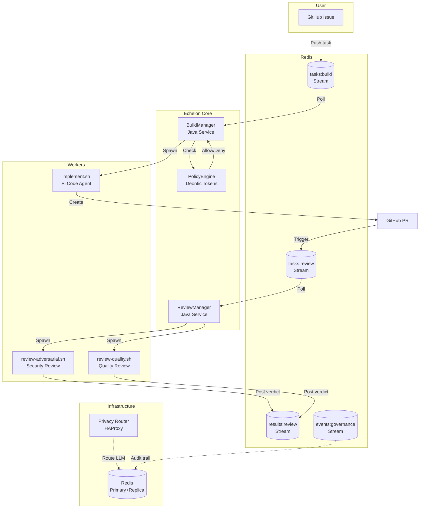

# Architecture Overview

Echelon is a hierarchical Docker-based agent swarm orchestration platform built on zero-trust principles.

## System Architecture

## Core Services

| Service | Role | Port |
|---------|------|------|
| **Privacy Router** | L7 credential proxy for LLM calls | 8080 |
| **Redis Primary** | Stream bus + state store | 6379 |
| **Redis Replica** | Read replica for metrics | 6380 |
| **Redis Sentinel** | Automatic failover | 26379 |
| **Prometheus** | Metrics collection | 9090 |
| **Builder** | Agent task executor | internal |

## Communication Flow

1. User creates a GitHub issue
2. Orchestrator reads issue via GitHub API
3. BuildManager queues task on `tasks:build` Redis stream
4. Builder container picks up task, consults PolicyEngine
5. Implementer agent forks repo, writes code, creates PR
6. PR URL pushed to `tasks:review` stream
7. Reviewer containers run adversarial + quality checks
8. Results streamed to `results:review` for merge decision

## Data Flow

The Redis stream bus is the central nervous system of Echelon. Every task, review, and governance event flows through a dedicated stream:

- **`tasks:build`** — Incoming task requests from users
- **`tasks:review`** — PRs requiring review after implementation
- **`results:review`** — Review verdicts from adversarial and quality reviewers
- **`events:governance`** — Audit trail of policy decisions and token evaluations

All streams are consumed via blocking reads, enabling near-real-time reactivity without polling overhead.
