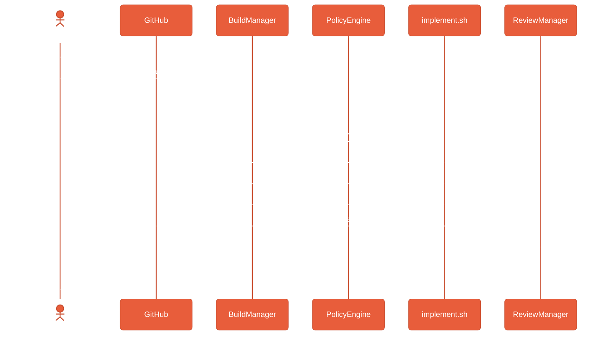

# Running Your First Task

This guide walks through creating an issue, having Echelon process it, and reviewing the result.

## Task Lifecycle



## Step 1: Create a GitHub Issue

```bash
gh issue create --title "Add unit test for PolicyEngine" \
  --body "Create a test that verifies the PolicyEngine correctly denies actions for unknown roles"
```

Note the issue number (e.g., #110).

## Step 2: Push the Task to the Pipeline

The BuildManager polls the `tasks:build` Redis stream every 5 seconds. Push a task:

```bash
docker compose exec redis-primary redis-cli XADD tasks:build \
  "*" taskId "task-110" issueUrl "https://github.com/thepragmatik/echelon/issues/110"
```

## Step 3: Watch the Pipeline Execute

```bash
# Watch BuildManager logs
docker compose logs -f builder

# Watch implementer logs
tail -f /tmp/echelon-pi-output-task-110.log
```

The BuildManager will:

1. Check the PolicyEngine (is implementer allowed to implement_task?)
2. Check the BudgetManager (is there enough token budget?)
3. Spawn `implement.sh` which clones the repo and runs Pi agent
4. The Pi agent generates code changes, compiles, commits, and creates a PR

## Step 4: Review the PR

The implementer creates a PR on GitHub. Navigate to the PR URL shown in the logs.

## Step 5: The Review Pipeline

The PR is pushed to the `tasks:review` Redis stream. The ReviewManager spawns:

1. **Adversarial review** — checks for security issues
2. **Quality review** — checks for code quality

Both reviews post verdicts to the `results:review` stream.

## Step 6: Merge

Once both reviews pass, merge the PR manually or via the auto-merge workflow.
