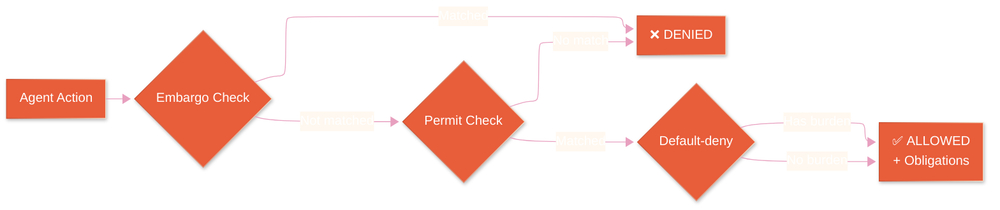

# Governance Model

Echelon uses a **deontic permission model** — three types of tokens govern every agent action.

## Policy Evaluation Flow

## Token Types

| Token | Meaning | Example |
|-------|---------|---------|
| **Permit** | Agent MAY perform this action | `implementer` can `write_source` |
| **Embargo** | Agent MUST NOT perform this action | `reviewer` cannot `write_to_main` |
| **Burden** | Agent MAY perform, but with obligations | `implementer` can `commit_feature_branch` but must `create_pr` and `pass_tests` |

## Policy Engine

The `PolicyEngine` evaluates every action at dispatch time:

1. **Check Embargoes** → if matched, DENY
2. **Check Permits** → if no match, DENY (default-deny)
3. **Check Burdens** → collect obligations
4. **Return ALLOW** with obligations list

Policies are defined in `agent-types.yaml` and can be hot-reloaded at runtime via the `RedisPolicyStore`.

## L7 Policy Enforcement

The Privacy Router enforces the same deontic model at the HTTP level:

- **Implementers** can POST (write code)
- **Reviewers/Architects** are GET-only (read-only)
- **Orchestrators** can merge PRs

## Default-Deny Principle

Every action starts from a default-deny position. An agent must have an explicit **Permit** token for the action it wants to perform. Without one, the action is blocked — even if no Embargo matches. This guarantees that new agent types added to the system are locked down by default until explicitly configured.
