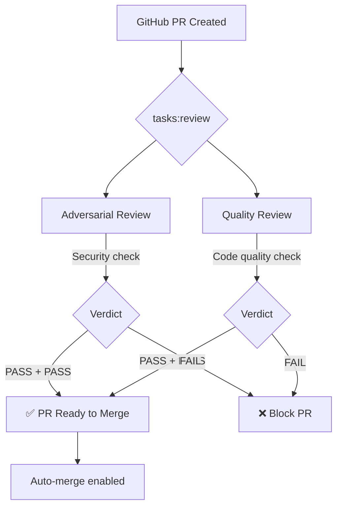

# Review Pipeline

Every PR created by an implementer agent passes through a dual-review pipeline before merging.

## Dual Review Flow



## Pipeline Stages

```text
PR Created
    │
    ▼
┌──────────────┐
│ Adversarial  │ ─── Security report
│ Review       │
└──────────────┘
    │
┌──────────────┐
│ Quality      │ ─── Quality report
│ Review       │
└──────────────┘
    │
    ▼
 Merge Decision (human or auto)
```

## Adversarial Review

The adversarial review checks for:

- **Injection attacks** — command injection, SQL injection, prompt injection
- **Credential leaks** — hardcoded API keys, tokens, passwords
- **Privilege escalation** — code that bypasses auth or role checks
- **Supply chain risks** — new dependencies without vetting

Run an adversarial review manually:

```bash
docker compose exec reviewer adversarial-review \
  --pr https://github.com/thepragmatik/echelon/pull/115
```

## Quality Review

The quality review checks:

- **Test coverage** — new code has corresponding tests
- **Code style** — matches project conventions (Checkstyle)
- **Architecture** — follows established patterns
- **Documentation** — public APIs are documented

Run a quality review manually:

```bash
docker compose exec reviewer quality-review \
  --pr https://github.com/thepragmatik/echelon/pull/115
```

## Results

Both reviews post structured results to the `results:review` Redis stream:

```json
{
  "reviewer": "adversarial",
  "pr": "https://github.com/thepragmatik/echelon/pull/115",
  "verdict": "PASS",
  "issues": [],
  "timestamp": "2026-07-27T12:00:00Z"
}
```

## Auto-Merge

When both reviews pass and the `auto-merge` flag is set, the orchestrator merges the PR automatically. Otherwise, a human reviews the reports and merges manually.
