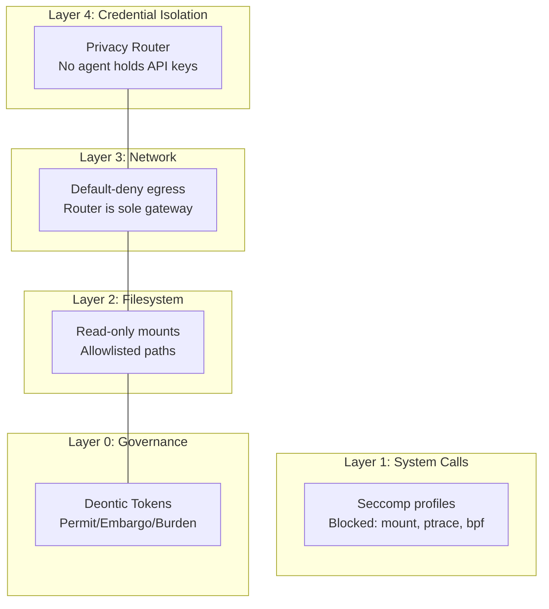

# Security Model

Echelon implements zero-trust security at every layer.

## Defense in Depth



## Zero-Trust Principles

| Principle | Implementation |
|-----------|---------------|
| **Verify explicitly** | Every agent action checked by PolicyEngine |
| **Least privilege** | Each agent type has minimal deontic tokens |
| **Assume breach** | Privacy Router isolates credential exposure |
| **Default deny** | No permit → action is denied |

## Credential Isolation

The **Privacy Router** is the only service with access to LLM API keys. Agents never see raw credentials:

```text
Agent ──► Privacy Router (owns API keys) ──► LLM Provider
              │
              ▼
         Audit Log
```

## Network Segmentation

- **Control plane** (Orchestrator, Redis) — internal Docker network only
- **Agent plane** (Builder, Reviewer) — isolated network, no inbound access
- **Public** (Privacy Router :8080) — minimal surface, authenticated only

## Policy Enforcement Points

1. **PolicyEngine** — deontic token checks at action dispatch
2. **Privacy Router** — HTTP-level L7 enforcement
3. **BudgetManager** — prevents token budget exhaustion
4. **Adversarial Review** — scans generated code pre-merge
5. **Git Branch Protection** — no direct pushes to main
